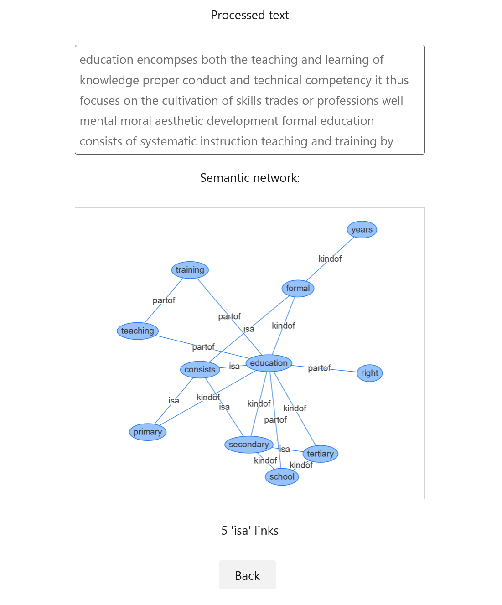
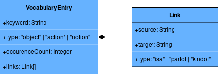
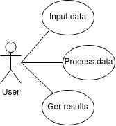
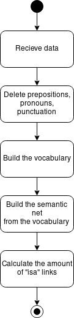
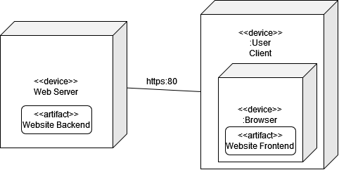

# Semantic Net

This is a small demo for simple semantic-net building algorithm.

In short:
1. Delete prepositions, pronouns, punctuation.
2. Build the vocabulary:
    ```
    {
        keyword: string,
        type: object | action | notion,
        occurenceCount: int,
        lins: Link[]
    }
    ```
3. Filter vocabulary with entries where `occurenceCount` is bigger than `two`.
4. Classify each vocabulary entry:
    > `As an object we consider all keywords which describe physical issues, things and phenomena. An action is infinitive form. All keywords that we have not classified as objects or actions are the notions.`
5. Build a semantic net, where the vertexes are the keywords from the vocabulary.
    > `Link between two nodes has three classes: «isa», «part of» и «kind of». The link «isa» symbolizes a rule «IF-THEN». It takes place between an object and an action or between two actions or two objects. The link «part of» is possible, when one term is a part of another. It occurs between two objects or actions only. The arc «kind of» describes the link between keywords “object” and “notion” only.`
6.  Calculate the amount of link `isa`.

The app is built using Node.js, Express.js, [Vis.js](https://github.com/visjs) for graph rendering, [Tacit](https://github.com/yegor256/tacit) as default CSS.

### How to run

1. Clone the repository.
2. Download dependencies: `npm install`.
3. Run the app: `npm run start`.
4. Access the app in a browser at `http://localhost`.

### Example

1. Input text to build a semantic net from. Text should be big enough and have recurring words, because the net will be builded from words that have at least two occurrences.
2. Toggle options:
    - Alternative neighbour count defines that linked words are not directly next to each other, but in a range of few words. This can help with some texts.
    - User 'partof' link enables scanning for 'partof' link. It occurs between object and action.
3. Press 'Build a net'

Result of running on example text with all options "ON":


### Diagrams

Class diagram:  


Use Case diagram:  


Activity diagram:  


Deployment diagram:  


### Sources

1. [Theoretical Fundamentals of Search Engine Optimization Based on Machine Learning](http://repository.kpi.kharkov.ua/handle/KhPI-Press/50288)
2. [Spinner](https://loading.io/css/)
3. [Toggle switch](https://www.w3schools.com/howto/howto_css_switch.asp)
4. [Vis.js](https://github.com/visjs)
5. [Tacit](https://github.com/yegor256/tacit)
